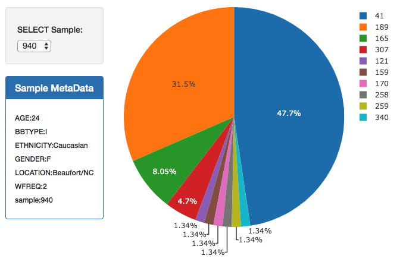
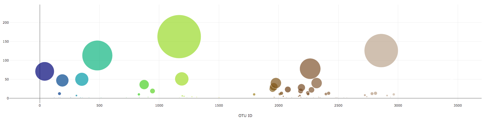
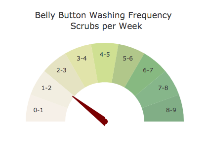

# Belly-Button-Biodiversity

## Background

This effort utilizes data analysis and development to build an interactive dashboard which explors the wonderful world of Belly Button Biodiversity.
The tools used are scientific data sets, coding using python, visualization using Plotly.js and D3, and app development using Flask, HTML, and Heroku.

## Objectives

### Step 1 - Plotly.js

Used Plotly.js to build interactive charts for the dashboard

* Created a Pie Chart that uses data from the samples route (`/samples/<sample>`) to display the top 10 samples
    * Use `sample_values` as the values for the Pie Chart
    * Use `otu_ids` as the labels for the Pie Chart
    * Use `otu_labels` as the hovertext for the Pie Chart

* Created a Bubble Chart that uses data from the samples route (`/samples/<sample>`) to display each sample
    * Use `otu_ids` for the x values
    * Use `sample_values` for the y values
    * Use `sample_values` for the marker size
    * Use `otu_ids` for the marker colors
    * Use `otu_labels` for the text values

* Display the sample metadata from the route `/metadata/<sample>`
    * Display each key/value pair from the metadata JSON object somewhere on the page

* Update all of the plots any time that a new sample is selected

* Adapt the Gauge Chart from <https://plot.ly/javascript/gauge-charts/> to plot the Weekly Washing Frequency obtained from the route `/wfreq/<sample>`
    * Modify the example gauge code to account for values ranging from 0 - 9
    * Update the chart whenever a new sample is selected

### Step 2 - Heroku

Deployed the Flask App to Heroku

#### Heroku Deployment:
Please visit: https://bbdhw.herokuapp.com/

### Step 3 - Flask API

Used Flask API code to serve the data needed for the plots

Copyright 2019 - Drew Seelig Design